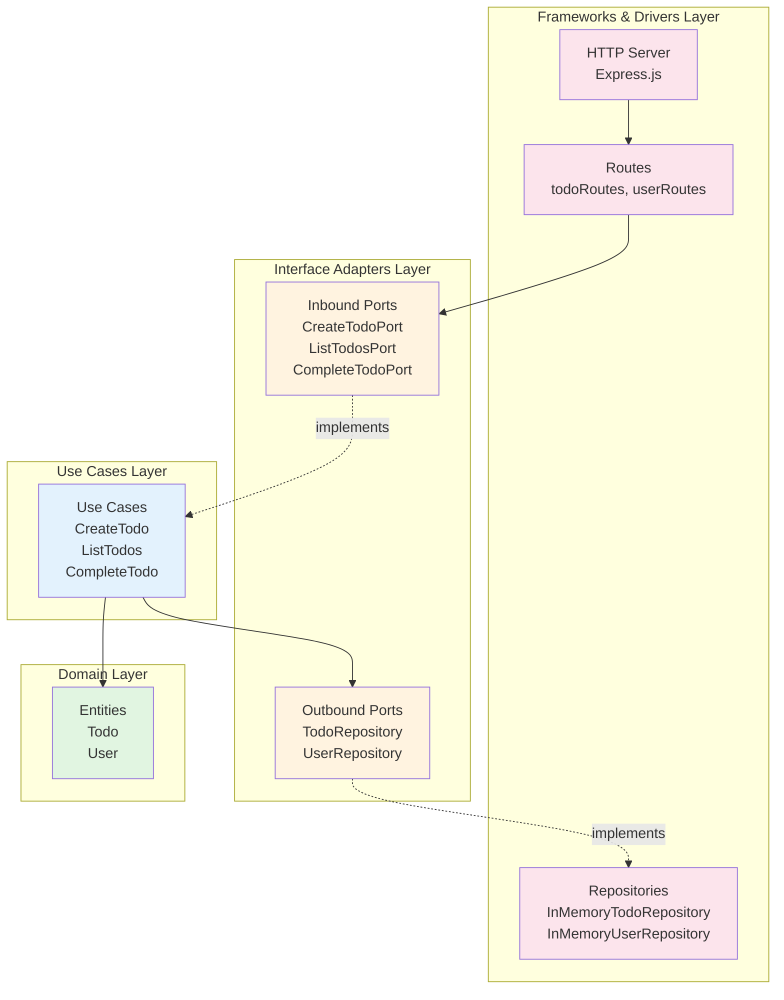
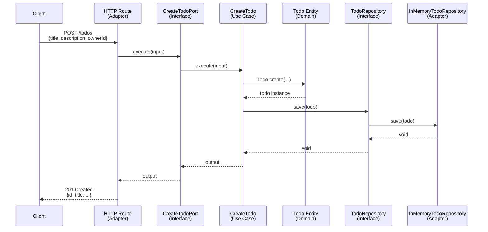
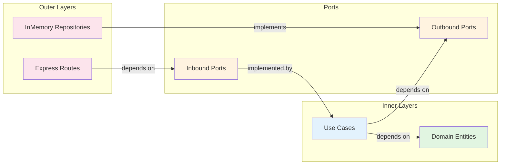

# Clean Todo

A modern todo application built with **Clean Architecture** (also known as **Hexagonal Architecture** or **Ports and Adapters**) principles, demonstrating best practices for building maintainable, testable, and scalable applications.

## 📋 Table of Contents

- [Project Overview](#-project-overview)
- [Architecture Documentation](#-architecture-documentation)
  - [What is Clean Architecture?](#what-is-clean-architecture)
  - [Architecture Layers](#architecture-layers)
  - [The Dependency Rule](#the-dependency-rule)
  - [Architecture Diagrams](#architecture-diagrams)
- [Project Structure](#-project-structure)
- [Getting Started](#-getting-started)
  - [Prerequisites](#prerequisites)
  - [Installation](#installation)
  - [Running the Application](#running-the-application)
- [API Endpoints](#-api-endpoints)
- [Development](#-development)

---

## 🎯 Project Overview

**Clean Todo** is a RESTful API for managing todos and users, built to showcase Clean Architecture principles in a real-world TypeScript application. The project emphasizes:

- **Separation of Concerns**: Business logic is completely isolated from frameworks and external dependencies
- **Testability**: Core business logic can be tested without any infrastructure
- **Flexibility**: Easy to swap implementations (e.g., switch from in-memory storage to a database)
- **Maintainability**: Clear boundaries between layers make the codebase easier to understand and modify

### Key Features

- Create and manage users
- Create, list, and complete todos
- Assign todos to users
- Built with TypeScript for type safety
- Express.js for HTTP layer
- In-memory persistence (easily replaceable with database)

---

## 🏛️ Architecture Documentation

### What is Clean Architecture?

Clean Architecture (also called Hexagonal Architecture or Ports and Adapters) is a software design pattern that separates business logic from external concerns like databases, frameworks, and UI. The key principle is that **business rules should not depend on external details**.

### Architecture Layers

This project implements Clean Architecture with the following layers:

```
┌─────────────────────────────────────────────────────────────┐
│                    Frameworks & Drivers                      │
│              (Express, HTTP Routes, Database)                │
│                    src/adapters/                             │
└─────────────────────────────────────────────────────────────┘
                              ↓
┌─────────────────────────────────────────────────────────────┐
│                    Interface Adapters                        │
│           (Controllers, Presenters, Gateways)                │
│                      src/ports/                              │
└─────────────────────────────────────────────────────────────┘
                              ↓
┌─────────────────────────────────────────────────────────────┐
│                      Use Cases                               │
│              (Application Business Rules)                    │
│                   src/use-cases/                             │
└─────────────────────────────────────────────────────────────┘
                              ↓
┌─────────────────────────────────────────────────────────────┐
│                       Entities                               │
│              (Enterprise Business Rules)                     │
│                    src/domain/                               │
└─────────────────────────────────────────────────────────────┘
```

#### 1. **Domain Layer** (`src/domain/`)
- **Purpose**: Contains enterprise business rules and entities
- **Contents**: Core business objects (User, Todo) with their invariants and business logic
- **Dependencies**: None - completely independent
- **Example**: `Todo` entity with validation rules and business methods like `complete()`

#### 2. **Use Cases Layer** (`src/use-cases/`)
- **Purpose**: Contains application-specific business rules
- **Contents**: Use case implementations (CreateTodo, CompleteTodo, etc.)
- **Dependencies**: Only depends on domain entities and port interfaces
- **Example**: `CreateTodo` orchestrates the creation of a todo, validates ownership, and persists it

#### 3. **Ports Layer** (`src/ports/`)
- **Purpose**: Defines interfaces (contracts) for communication between layers
- **Contents**: 
  - **Inbound Ports**: Interfaces for use cases (what the application can do)
  - **Outbound Ports**: Interfaces for external services (repositories, etc.)
- **Dependencies**: Only domain entities
- **Example**: `TodoRepository` interface defines how to persist todos without specifying implementation

#### 4. **Adapters Layer** (`src/adapters/`)
- **Purpose**: Implements the ports and connects to external systems
- **Contents**:
  - **Inbound Adapters**: HTTP routes, controllers
  - **Outbound Adapters**: Repository implementations, external service clients
- **Dependencies**: Implements port interfaces
- **Example**: `InMemoryTodoRepository` implements `TodoRepository` interface

### The Dependency Rule

**The Dependency Rule** is the most important principle in Clean Architecture:

> **Dependencies must point inward.** Outer layers can depend on inner layers, but inner layers must never depend on outer layers.

```
Frameworks & Drivers  →  Interface Adapters  →  Use Cases  →  Entities
     (Outer)                                                    (Inner)
```

This means:
- ✅ Use cases can depend on entities
- ✅ Adapters can depend on ports and use cases
- ❌ Entities cannot depend on use cases
- ❌ Use cases cannot depend on adapters

### Architecture Diagrams

#### Overall Architecture Layers



#### Request Flow: Creating a Todo



#### Dependency Direction



---

## 📁 Project Structure

```
clean-todo/
├── src/
│   ├── domain/                    # Domain Layer (Entities)
│   │   └── entities/
│   │       ├── Todo.ts           # Todo entity with business rules
│   │       └── User.ts           # User entity with validation
│   │
│   ├── use-cases/                # Use Cases Layer (Application Logic)
│   │   ├── todo/
│   │   │   ├── CreateTodo.ts    # Create todo use case
│   │   │   ├── ListTodos.ts     # List todos use case
│   │   │   └── CompleteTodo.ts  # Complete todo use case
│   │   ├── user/
│   │   │   ├── CreateUser.ts    # Create user use case
│   │   │   └── GetUser.ts       # Get user use case
│   │   └── errors/              # Application errors
│   │
│   ├── ports/                    # Interface Adapters (Ports)
│   │   ├── inbound/             # Inbound ports (use case interfaces)
│   │   │   ├── todo/
│   │   │   └── user/
│   │   └── outbound/            # Outbound ports (repository interfaces)
│   │       ├── TodoRepository.ts
│   │       └── UserRepository.ts
│   │
│   ├── adapters/                # Frameworks & Drivers (Adapters)
│   │   ├── inbound/
│   │   │   └── http/           # HTTP adapters (Express routes)
│   │   │       ├── routes/
│   │   │       │   ├── todoRoutes.ts
│   │   │       │   └── userRoutes.ts
│   │   │       └── errorHandler.ts
│   │   └── outbound/
│   │       └── persistence/    # Repository implementations
│   │           ├── InMemoryTodoRepository.ts
│   │           └── InMemoryUserRepository.ts
│   │
│   ├── shared/                  # Shared utilities
│   │   └── Id.ts               # ID generation
│   │
│   ├── container.ts            # Dependency injection container
│   └── main.ts                 # Application entry point
│
├── package.json
├── tsconfig.json
└── README.md
```

### Layer Responsibilities

- **`domain/`**: Pure business logic, no external dependencies
- **`use-cases/`**: Application workflows, orchestrates domain entities
- **`ports/`**: Contracts/interfaces for communication between layers
- **`adapters/`**: Concrete implementations of ports, framework-specific code
- **`container.ts`**: Wires up dependencies (Dependency Injection)
- **`main.ts`**: Application bootstrap and HTTP server setup

---

## 🚀 Getting Started

### Prerequisites

- **Bun** runtime (v1.0.0 or higher)
  - Install from [bun.sh](https://bun.sh)
  - Or via npm: `npm install -g bun`

### Installation

1. **Clone the repository**

```bash
git clone git@github.com:steve24grd/clean-todo.git
cd clean-todo
```

2. **Install dependencies**

```bash
bun install
```

### Running the Application

Start the development server:

```bash
bun run dev
```

The server will start on `http://localhost:3000` (or the port specified in the `PORT` environment variable).

You should see:
```
HTTP server listening on http://localhost:3000
```

---

## 🔌 API Endpoints

### Health Check

```http
GET /health
```

Returns: `{ "ok": true }`

### Users

#### Create User
```http
POST /users
Content-Type: application/json

{
  "name": "John Doe",
  "email": "john@example.com"
}
```

#### Get User
```http
GET /users/:id
```

### Todos

#### Create Todo
```http
POST /todos
Content-Type: application/json

{
  "title": "Buy groceries",
  "description": "Milk, eggs, bread",
  "ownerId": "user-id-here"  // optional
}
```

#### List Todos
```http
GET /todos
GET /todos?ownerId=user-id-here  // filter by owner
```

#### Complete Todo
```http
POST /todos/:id/complete
```

---

## 🛠️ Development

### Available Scripts

- `bun run dev` - Start the development server
- `bun run test` - Run tests (not yet implemented)

### Adding New Features

When adding new features, follow the Clean Architecture pattern:

1. **Start with the Domain**: Create or modify entities in `src/domain/`
2. **Define Ports**: Create interfaces in `src/ports/`
3. **Implement Use Cases**: Add business logic in `src/use-cases/`
4. **Create Adapters**: Implement concrete adapters in `src/adapters/`
5. **Wire Dependencies**: Update `src/container.ts`
6. **Add Routes**: Create HTTP routes in `src/adapters/inbound/http/routes/`

### Testing Strategy

The Clean Architecture makes testing straightforward:

- **Unit Tests**: Test domain entities and use cases in isolation
- **Integration Tests**: Test adapters with real implementations
- **E2E Tests**: Test the entire application through HTTP endpoints

---

## 📚 Learn More

- [Clean Architecture by Robert C. Martin](https://blog.cleancoder.com/uncle-bob/2012/08/13/the-clean-architecture.html)
- [Hexagonal Architecture](https://alistair.cockburn.us/hexagonal-architecture/)
- [Ports and Adapters Pattern](https://herbertograca.com/2017/09/14/ports-adapters-architecture/)

---

## 📄 License

ISC

---

**Built with ❤️ using Clean Architecture principles**

